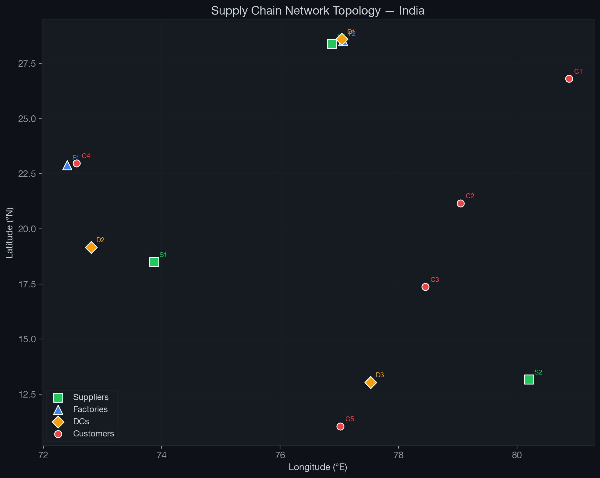
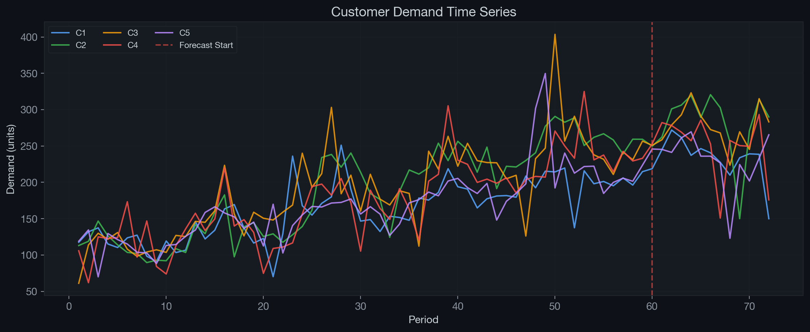
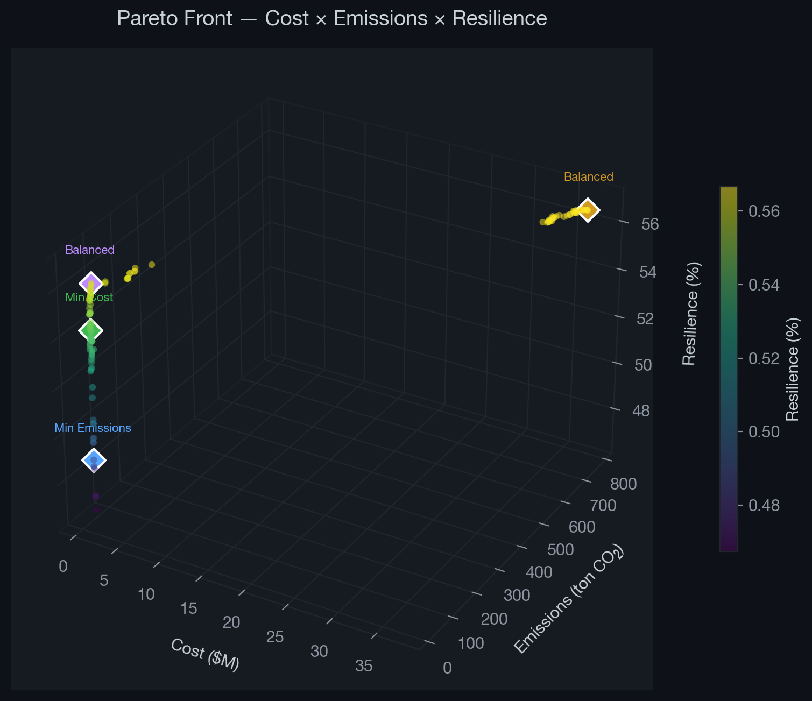
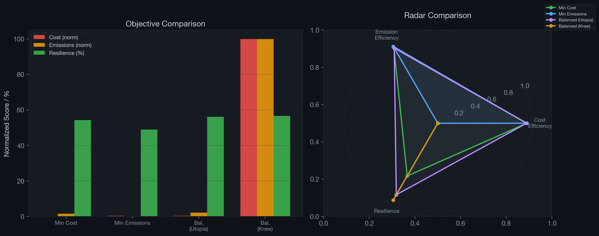
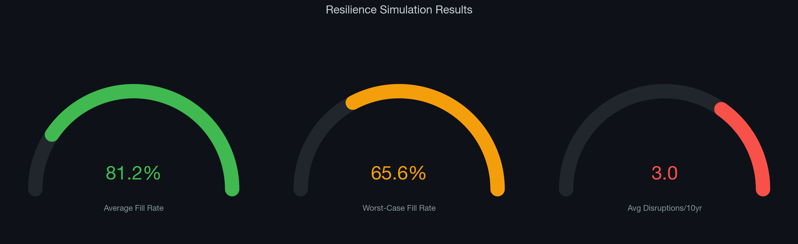

\newpage

<!-- ═══════════════ TITLE PAGE ═══════════════ -->

<div style="text-align:center; margin-top:60px;">

**INDIAN INSTITUTE OF TECHNOLOGY KHARAGPUR**

---

**Multi-Objective Optimization for Sustainable and Disruption-Resilient Supply Chain Network Design: An Integrated NSGA-II Framework with LCA Emissions and HHI-Based Resilience Metrics**

---

*A thesis submitted in partial fulfilment of the requirements for the degree of*

**Master of Technology**

*in*

**[Department Name]**

*by*

**Sagar**

*under the guidance of*

**Prof. [Supervisor Name]**

**[Department Name]**

**Indian Institute of Technology Kharagpur**

**April 2026**

</div>

\newpage

<!-- ═══════════════ CERTIFICATE ═══════════════ -->

## Certificate

This is to certify that the thesis entitled **"Multi-Objective Optimization for Sustainable and Disruption-Resilient Supply Chain Network Design: An Integrated NSGA-II Framework with LCA Emissions and HHI-Based Resilience Metrics"** submitted by **Sagar** (Roll No. XXXXXXXXX) to the Indian Institute of Technology Kharagpur, is a record of bona fide research work carried out by him under my supervision and guidance in partial fulfilment of the requirements for the award of the degree of **Master of Technology** in **[Department Name]**. The thesis has fulfilled all requirements as per the regulations of this institute and, in my opinion, has reached the standard needed for submission.

&nbsp;

Date: ________________

Place: IIT Kharagpur

&nbsp;

**Prof. [Supervisor Name]**

Department of [Department Name]

Indian Institute of Technology Kharagpur

\newpage

<!-- ═══════════════ DECLARATION ═══════════════ -->

## Declaration

I certify that

a. The work contained in this thesis is original and has been done by me under the guidance of my supervisor.

b. The work has not been submitted to any other institute for any degree or diploma.

c. I have followed the guidelines provided by the institute in preparing the thesis.

d. I have conformed to the norms and guidelines given in the Ethical Code of Conduct of the institute.

e. Whenever I have used materials (data, theoretical analysis, figures, and text) from other sources, I have given due credit to them by citing them in the text of the thesis and giving their details in the references.

&nbsp;

Date: ________________

**Sagar**

Roll No. XXXXXXXXX

\newpage

<!-- ═══════════════ ACKNOWLEDGEMENTS ═══════════════ -->

## Acknowledgements

I would like to express my sincere gratitude to my thesis supervisor **Prof. [Supervisor Name]**, Department of [Department Name], Indian Institute of Technology Kharagpur, for his/her invaluable guidance, continuous support, and constructive feedback throughout the course of this research work.

I also extend my thanks to the faculty members of the department for their valuable suggestions during the review presentations. I am grateful to my fellow research scholars for their insightful discussions and assistance.

Finally, I would like to thank my family and friends for their unwavering support and encouragement.

&nbsp;

**Sagar**

IIT Kharagpur, April 2026

\newpage

<!-- ═══════════════ ABSTRACT ═══════════════ -->

## Abstract

Supply chain network design (SCND) is a strategic decision problem that has traditionally been framed as a single-objective cost minimisation exercise. However, growing environmental regulations and recent disruption events demand that modern supply chains be designed with explicit consideration of carbon emissions and resilience to facility failures. This thesis develops an integrated multi-objective optimisation framework that simultaneously addresses cost efficiency, environmental sustainability, and disruption resilience within a four-echelon supply chain network for the Indian automotive sector.

The framework makes three principal modelling contributions. First, the cost objective is formulated following the multi-echelon facility location structure of Melo, Nickel, and Saldanha-da-Gama (2009), who established the decomposition of total supply chain cost into procurement, production, transportation, and inventory holding components. This is extended with an unmet demand penalty term from Jabbarzadeh, Fahimnia, and Sabouhi (2018), who demonstrated that incorporating shortage costs into the objective function captures the economic impact of supply disruptions more realistically than hard demand constraints. Second, the emission objective adopts the Life Cycle Assessment (LCA) approach of Pishvaee and Razmi (2012), which decomposes total emissions into facility-level and transport-level components across all echelons, with transport emission factors weighted by traffic congestion multipliers as proposed by Pishvaee, Torabi, and Razmi (2012). Third, the resilience objective introduces a composite metric that combines the Herfindahl–Hirschman Index (HHI) from Hasani and Khosrojerdi (2016), originally used to penalise supply concentration in robust SCND, with the expected node-failure coverage model of Snyder and Daskin (2005), which quantifies worst-case demand fulfilment under single-facility failures.

The optimisation is solved using the NSGA-II algorithm (Deb et al., 2002), preceded by Random Forest demand forecasting (Breiman, 2001) and followed by SimPy-based Monte Carlo disruption simulation. Computational experiments on a 13-node test network with 54 continuous decision variables yield 105 Pareto-optimal solutions in under 8 seconds. The simulation validates the resilience proxy with an average demand fill rate of 81.2% across 100 stochastic runs.

**Keywords:** Supply Chain Network Design, Multi-Objective Optimization, NSGA-II, Life Cycle Assessment, Herfindahl–Hirschman Index, Disruption Resilience, Random Forest Forecasting, Monte Carlo Simulation

\newpage

<!-- ═══════════════ NOTATION ═══════════════ -->

## List of Symbols and Abbreviations

### Sets

| Symbol | Description |
|--------|-------------|
| $I$ | Set of suppliers, indexed by $i$; $\|I\| = 3$ |
| $J$ | Set of factories, indexed by $j$; $\|J\| = 2$ |
| $K$ | Set of distribution centres (DCs), indexed by $k$; $\|K\| = 3$ |
| $L$ | Set of customers, indexed by $l$; $\|L\| = 5$ |
| $M$ | Set of transport modes, $M = \{\text{road}, \text{rail}\}$; $\|M\| = 2$ |

### Decision Variables

| Symbol | Description | Unit |
|--------|-------------|------|
| $x_{ijm}$ | Flow from supplier $i$ to factory $j$ via mode $m$ | units |
| $y_{jkm}$ | Flow from factory $j$ to DC $k$ via mode $m$ | units |
| $z_{klm}$ | Flow from DC $k$ to customer $l$ via mode $m$ | units |

### Parameters

| Symbol | Description | Unit |
|--------|-------------|------|
| $s_i$ | Procurement cost per unit at supplier $i$ | \$/unit |
| $e_i$ | Emission factor at supplier $i$ | kg CO$_2$/unit |
| $p_j$ | Production cost per unit at factory $j$ | \$/unit |
| $\varepsilon_j$ | Production emission factor at factory $j$ | kg CO$_2$/unit |
| $h_k$ | Holding cost per unit at DC $k$ | \$/unit |
| $\xi_k$ | Warehousing emission factor at DC $k$ | kg CO$_2$/unit |
| $C_i$ | Supply capacity of supplier $i$ | units |
| $F_j$ | Production capacity of factory $j$ | units |
| $D_k$ | Storage capacity of DC $k$ | units |
| $d_l$ | Demand of customer $l$ | units |
| $\delta_{ab}$ | Distance between nodes $a$ and $b$ | km |
| $\gamma_{ab}$ | Traffic congestion factor on arc $(a, b)$ | dimensionless, $\geq 1$ |
| $t_m$ | Unit transport cost for mode $m$ | \$/unit-km |
| $\tau_m$ | Unit transport emission factor for mode $m$ | kg CO$_2$/unit-km |
| $\pi$ | Shortage penalty cost per unit of unmet demand | \$/unit |
| $w_1, w_2$ | Resilience component weights | dimensionless |

### Abbreviations

| Abbreviation | Full Form |
|--------------|-----------|
| SCND | Supply Chain Network Design |
| NSGA-II | Non-dominated Sorting Genetic Algorithm II |
| HHI | Herfindahl–Hirschman Index |
| LCA | Life Cycle Assessment |
| DC | Distribution Centre |
| DSS | Decision Support System |
| MTTF | Mean Time To Failure |
| MTTR | Mean Time To Repair |

\newpage

<!-- ═══════════════ CHAPTER 1 ═══════════════ -->

## Chapter 1: Introduction

### 1.1 Background and Motivation

Modern supply chains operate in an increasingly volatile global environment. The COVID-19 pandemic, the 2021 Suez Canal blockage, and ongoing geopolitical tensions have exposed the fragility of lean, cost-optimised supply networks. Industry losses from supply chain disruptions exceeded \$80 billion in 2020 alone, prompting a fundamental rethinking of network design priorities (Pettit, Fiksel, and Croxton, 2010).

Simultaneously, environmental regulations—such as the European Green Deal and India's National Action Plan on Climate Change—demand measurable reductions in industrial carbon footprints. The logistics and manufacturing sectors together account for approximately 25% of global CO$_2$ emissions, making supply chain design a critical lever for environmental improvement.

Traditional SCND formulations focus on a single objective, typically total cost minimisation. While effective for economic optimisation, they fail to capture the inherent trade-offs among cost, environmental impact, and operational resilience. For instance, the lowest-cost network configuration often concentrates flows through a few high-capacity nodes, creating single points of failure. Conversely, maximising resilience through diversification increases logistics costs. Multi-objective optimisation provides a principled framework for exploring these trade-offs, producing a set of Pareto-optimal solutions from which decision-makers can select according to their strategic priorities.

### 1.2 Problem Statement

This thesis addresses the following multi-objective optimisation problem:

> *Given a four-echelon supply chain network consisting of 3 suppliers, 2 factories, 3 distribution centres, and 5 customers connected by two transport modes (road and rail) and mapped to Indian automotive geography, determine the optimal material flow allocation across 54 continuous decision variables ($x_{ijm}$, $y_{jkm}$, $z_{klm}$) that simultaneously:*
>
> *(a) minimises total landed cost — comprising procurement, production, congestion-weighted transport, DC holding, and unmet demand penalty costs (formulated after Melo et al., 2009 and Jabbarzadeh et al., 2018);*
>
> *(b) minimises total life-cycle carbon emissions — comprising supplier-level, production-level, congestion-weighted transport, and DC warehousing emission components (formulated after Pishvaee and Razmi, 2012 and Pishvaee, Torabi, and Razmi, 2012);*
>
> *(c) maximises a composite resilience score — combining the Herfindahl–Hirschman Index (HHI) for supply diversification (after Hasani and Khosrojerdi, 2016) with worst-case single-node-failure demand coverage (after Snyder and Daskin, 2005);*
>
> *subject to supply capacity, factory capacity, DC capacity, flow balance, demand satisfaction, and non-negativity constraints — using NSGA-II evolutionary optimisation preceded by Random Forest demand forecasting and validated through Monte Carlo disruption simulation.*

The problem is non-trivial because the three objectives are inherently conflicting: cost minimisation tends to concentrate flows through a few low-cost, high-capacity routes, which reduces diversification and thus resilience; emission minimisation favours rail-heavy, low-emission routes that may bypass geographically diverse nodes; and resilience maximisation distributes flows across multiple paths and modes, increasing both cost and emissions. No single solution can optimise all three objectives simultaneously, necessitating a Pareto-based multi-objective approach.

### 1.3 Scope and Delimitations

This thesis considers a four-echelon supply chain (Suppliers $\rightarrow$ Factories $\rightarrow$ Distribution Centres $\rightarrow$ Customers) with two transport modes (road and rail) applied to the Indian automotive sector. The scope includes:

- **Network design:** Single-product, single-period flow allocation with 54 continuous decision variables.
- **Demand estimation:** Random Forest regression with 15 engineered features per customer over 72 historical periods.
- **Optimisation:** NSGA-II with population size 120, 300 generations (36,000 evaluations).
- **Validation:** Monte Carlo disruption simulation with 100 runs over a 10-year horizon.
- **Visualisation:** Interactive Streamlit dashboard for stakeholder trade-off analysis.

The following are explicitly **outside the scope** of this work: (a) real company data deployment — the framework is validated on synthetic data grounded in realistic Indian geography; (b) facility location decisions — node locations are treated as predetermined; (c) multi-period inventory dynamics; and (d) stochastic/robust formulations with chance constraints.

### 1.4 Research Contributions

1. **Integrated pipeline:** A reproducible framework combining Random Forest forecasting, NSGA-II optimisation, and Monte Carlo simulation within a single Python codebase.

2. **Traceable formulations:** Every component of the three objective functions is explicitly traced to a published paper (six papers in total), enabling academic defence of each modelling decision.

3. **Composite resilience metric:** A novel combination of the HHI supply diversification index (Hasani and Khosrojerdi, 2016) with expected node-failure coverage (Snyder and Daskin, 2005), validated through simulation.

4. **Multi-modal congestion-aware modelling:** Transport cost and emissions are modulated by arc-specific congestion factors and mode-dependent coefficients.

5. **Interactive Decision Support System (DSS):** A Streamlit dashboard for stakeholder visualisation of trade-offs.

### 1.5 Organisation of the Thesis

- **Chapter 2:** Literature Review — survey of relevant work in SCND, green SC, resilience, and forecasting.
- **Chapter 3:** Problem Definition — network topology, decision variables, constraints, and assumptions.
- **Chapter 4:** Mathematical Formulation — detailed development of the three objective functions with paper traceability.
- **Chapter 5:** Solution Methodology — forecasting, NSGA-II, simulation, and DSS.
- **Chapter 6:** Results and Discussion — computational experiments and analysis.
- **Chapter 7:** Conclusion — summary, limitations, and future directions.

\newpage

<!-- ═══════════════ CHAPTER 2 ═══════════════ -->

## Chapter 2: Literature Review

### 2.1 Supply Chain Network Design

Supply Chain Network Design (SCND) is a strategic-level problem that determines the configuration of a supply chain, including facility locations, capacity allocation, and material flow patterns. The field has evolved from single-echelon facility location problems to complex multi-echelon, multi-product, multi-period formulations.

**Melo, Nickel, and Saldanha-da-Gama (2009)** present a comprehensive review of facility location models in the SCND context. Their paper systematically categorises cost components into five layers: (i) fixed costs for opening facilities, (ii) procurement/sourcing costs, (iii) production/processing costs at transforming nodes, (iv) transportation costs across arcs, and (v) inventory holding costs at storage nodes. They argue that this five-layer decomposition generalises across most multi-echelon configurations and should form the structural backbone of any SCND cost formulation. Our cost objective (Chapter 4) directly adopts this decomposition, omitting fixed costs since facility locations are treated as predetermined.

### 2.2 Multi-Objective Optimisation in Supply Chains

When multiple conflicting objectives are considered simultaneously, no single solution can optimise all objectives; instead, a set of Pareto-optimal (non-dominated) solutions represents the best achievable trade-offs. Evolutionary algorithms are widely used to approximate this Pareto front.

**Deb, Pratap, Agarwal, and Meyarivan (2002)** proposed the Non-dominated Sorting Genetic Algorithm II (NSGA-II), which has become the benchmark for multi-objective evolutionary optimisation. NSGA-II introduces two key innovations: (a) a computationally efficient $O(MN^2)$ non-dominated sorting procedure, and (b) a crowding distance metric that promotes solution diversity along the Pareto front. These properties make it particularly suited for SCND problems where the objective landscape is non-convex and discontinuous. In this thesis, NSGA-II is used to solve the three-objective problem via the pymoo library implementation.

### 2.3 Green Supply Chain and Emission Modelling

Environmental considerations in SCND have received growing attention.

**Pishvaee and Razmi (2012)** pioneered the integration of Life Cycle Assessment (LCA) methodology into SCND optimisation. Their contribution is the recognition that a comprehensive emission model must account for emissions at every stage of the supply chain life cycle, not merely transport. Specifically, they decompose total emissions into: (a) emissions from raw material extraction and processing at suppliers, (b) production emissions at manufacturing facilities, (c) transport emissions across arcs, and (d) warehousing emissions from energy consumption at storage facilities. Our emission objective (Equation 4.3 in Chapter 4) directly implements this four-component LCA structure.

**Pishvaee, Torabi, and Razmi (2012)** extended this work by introducing congestion-weighted transport emission factors. They observe that transport emissions are not simply proportional to distance $\times$ volume; urban congestion, terrain, and road quality cause deviations from base emission rates. They model this by multiplying the base transport emission factor by a route-specific congestion multiplier $\gamma_{ab} \geq 1$. Our formulation adopts this congestion-weighting approach for both cost and emission transport terms.

### 2.4 Supply Chain Resilience

Resilience in supply chains refers to the ability of a network to withstand, adapt to, and recover from disruptions. The literature approaches resilience through two complementary paradigms:

**Hasani and Khosrojerdi (2016)** address resilience from a *structural diversification* perspective. Their insight is that supply chain vulnerability is fundamentally about concentration risk: a network where all demand is served by a single supplier or a single distribution centre is inherently fragile, regardless of how reliable that individual node is. They adopt the Herfindahl–Hirschman Index (HHI)—a measure originally developed for market concentration in antitrust economics—as a quantitative proxy for supply concentration. The HHI is defined as the sum of squared market shares; in the supply chain context, "market shares" become "flow shares" through each node. An HHI of 1.0 indicates total concentration (all flow through one node), while $1/n$ indicates perfect diversification across $n$ nodes. Their model includes the HHI as a penalty term to encourage multi-sourcing. In our resilience objective (Section 4.4.1), we compute the HHI separately for upstream (supplier $\rightarrow$ factory) and downstream (DC $\rightarrow$ customer) flows, then average them to capture diversification at both ends of the supply chain.

**Snyder and Daskin (2005)** approach resilience from a *failure scenario* perspective. Rather than measuring diversification as a structural property, they directly quantify how much demand can still be served when specific nodes fail. Their "reliability model for facility location" defines the expected failure cost as the weighted sum of demand coverage losses across all possible facility failure scenarios. For a level-$r$ model, each demand point has $r$ backup facilities assigned. In our adaptation (Section 4.4.2), we compute the worst-case single-node failure coverage: for each node $n$ (supplier, factory, or DC), we calculate the fraction of total flow that passes through $n$, and the coverage ratio is $1$ minus that fraction. The minimum coverage across all nodes gives the worst-case vulnerability.

**Jabbarzadeh, Fahimnia, and Sabouhi (2018)** bridge cost and resilience by introducing unmet demand penalties. In their stochastic programming model for resilient and sustainable SCND, they penalise unmet demand with a cost of $\pi$ per unit. This converts the hard demand constraint ($\text{supply} \geq \text{demand}$) into a soft penalty that naturally captures the trade-off between cost and service level under disruptions. Our cost objective (Equation 4.2) adopts their penalty formulation with $\pi = 500$ \$/unit.

### 2.5 Demand Forecasting

Accurate demand estimation is a prerequisite for meaningful network design. **Random Forest regression**, introduced by **Breiman (2001)**, is an ensemble method that constructs multiple decision trees on bootstrapped samples and averages their predictions. It is well-suited for supply chain demand forecasting because: (a) it captures non-linear demand patterns that arise from seasonality and regime changes, (b) it handles feature interactions without explicit specification, and (c) it is robust to outliers common in demand data. In this thesis, we enhance the basic Random Forest with engineered features including lag variables, Fourier seasonal components, and rolling statistics.

### 2.6 Research Gap

While individual aspects of cost-efficient, green, and resilient SCND are well studied, there is a notable gap in works that integrate all three objectives in a single framework that additionally incorporates: (a) multi-modal transport mode decisions (road vs. rail), (b) congestion effects on both cost and emissions, (c) machine learning-based demand forecasting, and (d) simulation-based validation of the resilience metric. This thesis addresses this gap by developing an integrated pipeline that is reproducible and academically traceable.

\newpage

<!-- ═══════════════ CHAPTER 3 ═══════════════ -->

## Chapter 3: Problem Definition and Network Structure

### 3.1 Network Topology

The supply chain considered in this thesis is a **four-echelon, multi-modal network** mapped to the Indian automotive sector.

**Table 3.1: Network echelons and representative locations**

| Echelon | Notation | Count | Representative Locations |
|---------|----------|-------|--------------------------|
| Suppliers | $I = \{S_1, S_2, S_3\}$ | 3 | Pune, Chennai, Manesar |
| Factories | $J = \{F_1, F_2\}$ | 2 | Gujarat, Haryana |
| Distribution Centres | $K = \{D_1, D_2, D_3\}$ | 3 | Delhi, Mumbai, Bangalore |
| Customers | $L = \{C_1, \ldots, C_5\}$ | 5 | Lucknow, Nagpur, Hyderabad, Ahmedabad, Coimbatore |
| Transport Modes | $M = \{m_1, m_2\}$ | 2 | Road, Rail |

Material flows follow the sequence Suppliers $\rightarrow$ Factories $\rightarrow$ DCs $\rightarrow$ Customers. Each arc between consecutive echelons can utilise either road or rail transport, yielding a bimodal network with three layers of flow decisions. The geographic layout of the network is shown in Figure 3.1.



### 3.2 Decision Variables

- $x_{ijm} \geq 0$: Units shipped from supplier $i \in I$ to factory $j \in J$ via mode $m \in M$
- $y_{jkm} \geq 0$: Units shipped from factory $j \in J$ to DC $k \in K$ via mode $m \in M$
- $z_{klm} \geq 0$: Units shipped from DC $k \in K$ to customer $l \in L$ via mode $m \in M$

The total number of continuous decision variables is:

$$n_{\text{vars}} = |I| \cdot |J| \cdot |M| + |J| \cdot |K| \cdot |M| + |K| \cdot |L| \cdot |M| = 3 \times 2 \times 2 + 2 \times 3 \times 2 + 3 \times 5 \times 2 = 54 \tag{3.1}$$

### 3.3 Constraints

**Constraint 1 — Supply capacity.** The total outflow from each supplier must not exceed its capacity:

$$\sum_{j \in J} \sum_{m \in M} x_{ijm} \leq C_i \quad \forall \, i \in I \tag{3.2}$$

**Constraint 2 — Factory flow balance.** Material conservation at each factory (inflow = outflow):

$$\sum_{i \in I} \sum_{m \in M} x_{ijm} = \sum_{k \in K} \sum_{m \in M} y_{jkm} \quad \forall \, j \in J \tag{3.3}$$

**Constraint 3 — Factory capacity.** The total throughput at each factory must not exceed its production capacity:

$$\sum_{i \in I} \sum_{m \in M} x_{ijm} \leq F_j \quad \forall \, j \in J \tag{3.4}$$

**Constraint 4 — DC flow balance.** Material conservation at each distribution centre:

$$\sum_{j \in J} \sum_{m \in M} y_{jkm} = \sum_{l \in L} \sum_{m \in M} z_{klm} \quad \forall \, k \in K \tag{3.5}$$

**Constraint 5 — DC capacity.** The total throughput at each DC must not exceed its storage capacity:

$$\sum_{j \in J} \sum_{m \in M} y_{jkm} \leq D_k \quad \forall \, k \in K \tag{3.6}$$

**Constraint 6 — Demand satisfaction.** The total supply to each customer must meet or exceed its demand:

$$\sum_{k \in K} \sum_{m \in M} z_{klm} \geq d_l \quad \forall \, l \in L \tag{3.7}$$

**Constraint 7 — Non-negativity:**

$$x_{ijm}, \; y_{jkm}, \; z_{klm} \geq 0 \quad \forall \, i, j, k, l, m \tag{3.8}$$

### 3.4 Assumptions

1. Single product type, single planning period; demand obtained from the forecasting module.
2. Facility locations are fixed and predetermined; capacities are deterministic.
3. Cost and emission functions are linear in the flow variables.
4. Congestion factors are static during optimisation but stochastic during simulation.
5. Facility failures follow exponential distributions (MTTF and MTTR) for simulation.

\newpage

<!-- ═══════════════ CHAPTER 4 ═══════════════ -->

## Chapter 4: Mathematical Model Formulation

This chapter develops the three objective functions that constitute the multi-objective optimisation problem. A key contribution of this thesis is that **every component of every objective function is explicitly traced to a specific published paper**, enabling the reader to verify the academic basis for each modelling decision.

### 4.1 Multi-Objective Problem Statement

The problem is formulated as:

$$\min \; f_1(\mathbf{x}, \mathbf{y}, \mathbf{z}), \quad \min \; f_2(\mathbf{x}, \mathbf{y}, \mathbf{z}), \quad \max \; f_3(\mathbf{x}, \mathbf{y}, \mathbf{z}) \tag{4.1}$$

subject to constraints (3.2)–(3.8), where $f_1$ is total cost, $f_2$ is total carbon emissions, and $f_3$ is the composite resilience score.

### 4.2 Objective 1: Total Cost Minimisation

**Primary source: Melo, Nickel, and Saldanha-da-Gama (2009), *European Journal of Operational Research*, 196(2), 401–412.**

Melo et al. (2009) review over 200 papers on facility location in supply chain management and identify a canonical cost structure for multi-echelon SCND. They establish that total supply chain cost should be decomposed into: (i) procurement costs at source nodes, (ii) processing/production costs at transformation nodes, (iii) transportation costs on inter-echelon arcs, and (iv) inventory holding costs at storage nodes. Their argument is that this decomposition captures the full "total landed cost" and generalises across single-product and multi-product networks, single-period and multi-period settings, and various echelon configurations. We adopt their four-component decomposition for our four-echelon network.

**Extension source: Jabbarzadeh, Fahimnia, and Sabouhi (2018), *International Journal of Production Research*, 56(17), 5945–5968.**

Jabbarzadeh et al. (2018) develop a stochastic programming model for resilient and sustainable SCND under disruption risks. A key contribution of their paper is the introduction of **unmet demand penalty costs**: rather than treating demand satisfaction as a hard constraint (which can make the problem infeasible under disruptions), they penalise unmet demand with a cost $\pi$ per unit of shortfall. This formulation has two advantages: (a) it keeps the problem feasible even when supply capacity is insufficient, and (b) it directly quantifies the economic impact of service failures, enabling trade-off analysis between cost and service level. We adopt their shortage penalty formulation as the seventh term in our cost objective, setting $\pi = 500$ \$/unit based on their recommended range for automotive components.

**Complete cost formulation:**

The total cost $f_1$ is the sum of five components:

$$f_1 = C_{\text{proc}} + C_{\text{prod}} + C_{\text{trans}} + C_{\text{hold}} + C_{\text{short}} \tag{4.2}$$

*Term 1 — Procurement cost (Melo et al., 2009):*

$$C_{\text{proc}} = \sum_{i \in I} \sum_{j \in J} \sum_{m \in M} s_i \cdot x_{ijm} \tag{4.2a}$$

*Term 2 — Production cost (Melo et al., 2009):*

$$C_{\text{prod}} = \sum_{j \in J} p_j \cdot \left( \sum_{i \in I} \sum_{m \in M} x_{ijm} \right) \tag{4.2b}$$

*Term 3 — Transport cost across all echelon transitions (Melo et al., 2009; congestion from Pishvaee, Torabi, and Razmi, 2012):*

$$C_{\text{trans}} = \sum_{i,j,m} t_m \cdot \delta_{ij} \cdot \gamma_{ij} \cdot x_{ijm} + \sum_{j,k,m} t_m \cdot \delta_{jk} \cdot \gamma_{jk} \cdot y_{jkm} + \sum_{k,l,m} t_m \cdot \delta_{kl} \cdot \gamma_{kl} \cdot z_{klm} \tag{4.2c}$$

*Term 4 — Holding cost at DCs (Melo et al., 2009):*

$$C_{\text{hold}} = \sum_{k \in K} h_k \cdot \left( \sum_{j \in J} \sum_{m \in M} y_{jkm} \right) \tag{4.2d}$$

*Term 5 — Unmet demand penalty (Jabbarzadeh et al., 2018):*

$$C_{\text{short}} = \pi \cdot \sum_{l \in L} \max \left( 0, \; d_l - \sum_{k \in K} \sum_{m \in M} z_{klm} \right) \tag{4.2e}$$

**Explanation of each term:**

- **(4.2a) Procurement cost:** The cost of purchasing raw materials from suppliers. Each unit shipped from supplier $i$ incurs a per-unit procurement cost $s_i$, regardless of destination or transport mode. This is the first-layer cost in the Melo et al. (2009) decomposition.

- **(4.2b) Production cost:** The cost of processing/manufacturing at factories. The total inflow to factory $j$ (summed over all suppliers and modes) is multiplied by the per-unit production cost $p_j$. This is the second-layer cost in the Melo et al. (2009) decomposition.

- **(4.2c) Transport cost:** The cost of shipping goods across all three inter-echelon transitions (Supplier to Factory, Factory to DC, DC to Customer). For each arc, the cost is: unit transport rate $t_m$ for mode $m$ multiplied by distance $\delta_{ab}$, congestion factor $\gamma_{ab}$, and flow volume. The congestion factor $\gamma_{ab} \geq 1$ inflates costs on congested routes; this element is adapted from Pishvaee, Torabi, and Razmi (2012), who argue that ignoring congestion systematically underestimates logistics costs.

- **(4.2d) Holding cost:** The cost of warehousing goods at distribution centres. Each unit flowing through DC $k$ incurs a per-unit holding cost $h_k$. This is the fourth-layer cost in the Melo et al. (2009) decomposition.

- **(4.2e) Shortage penalty:** Adopted directly from Jabbarzadeh et al. (2018). When the supply to customer $l$ falls short of demand $d_l$, the deficit $(d_l - \sum_{k,m} z_{klm})$ is penalised at rate $\pi = 500$ $/unit. This term is zero when demand is fully met and positive when there is a shortfall, effectively converting the hard demand constraint into a soft objective component.

### 4.3 Objective 2: Total Carbon Emissions Minimisation

**Primary source: Pishvaee and Razmi (2012), *Applied Mathematical Modelling*, 36(8), 3433–3446.**

Pishvaee and Razmi (2012) were among the first to apply Life Cycle Assessment (LCA) principles to SCND optimisation. Their key insight is that a naive emission model that only counts transport emissions severely underestimates the true environmental impact, because significant emissions occur at facilities themselves—from raw material processing at suppliers, energy-intensive manufacturing at factories, and electricity consumption for refrigeration and lighting at warehouses. Their LCA framework decomposes total emissions into facility-level and transport-level components at every stage of the supply chain, yielding a comprehensive environmental assessment.

Specifically, their model introduces three types of facility emissions that are absent from transport-only models: (i) **supplier emissions** ($e_i$ per unit), representing CO$_2$ from raw material extraction and processing; (ii) **production emissions** ($\varepsilon_j$ per unit), representing CO$_2$ from manufacturing energy consumption; and (iii) **warehousing emissions** ($\xi_k$ per unit), representing CO$_2$ from DC operations including climate control, material handling, and lighting. Our emission objective directly implements all three facility-level components.

**Extension source: Pishvaee, Torabi, and Razmi (2012), *Computers and Industrial Engineering*, 62(2), 624–632.**

Pishvaee, Torabi, and Razmi (2012) extend the emission model by introducing **congestion-weighted transport emission factors**. They argue that base emission rates (kg CO$_2$/unit-km) assume free-flow traffic conditions, which rarely hold in practice. Urban congestion causes vehicles to idle, accelerate, and decelerate repeatedly, increasing fuel consumption and emissions beyond the base rate. They model this by multiplying the base emission factor $\tau_m$ by a route-specific congestion multiplier $\gamma_{ab} \geq 1$. This same congestion factor simultaneously affects cost (vehicles spend more time and fuel on congested routes). Our formulation adopts this congestion-weighting for all three transport terms.

**Complete emission formulation:**

The total emissions $f_2$ comprise four components:

$$f_2 = E_{\text{sup}} + E_{\text{prod}} + E_{\text{trans}} + E_{\text{wh}} \tag{4.3}$$

*Term 1 — Supplier emissions (Pishvaee and Razmi, 2012):*

$$E_{\text{sup}} = \sum_{i \in I} \sum_{j \in J} \sum_{m \in M} e_i \cdot x_{ijm} \tag{4.3a}$$

*Term 2 — Production emissions (Pishvaee and Razmi, 2012):*

$$E_{\text{prod}} = \sum_{j \in J} \varepsilon_j \cdot \left( \sum_{i \in I} \sum_{m \in M} x_{ijm} \right) \tag{4.3b}$$

*Term 3 — Congestion-weighted transport emissions (Pishvaee, Torabi, and Razmi, 2012):*

$$E_{\text{trans}} = \sum_{i,j,m} \tau_m \cdot \delta_{ij} \cdot \gamma_{ij} \cdot x_{ijm} + \sum_{j,k,m} \tau_m \cdot \delta_{jk} \cdot \gamma_{jk} \cdot y_{jkm} + \sum_{k,l,m} \tau_m \cdot \delta_{kl} \cdot \gamma_{kl} \cdot z_{klm} \tag{4.3c}$$

*Term 4 — DC warehousing emissions (Pishvaee and Razmi, 2012):*

$$E_{\text{wh}} = \sum_{k \in K} \xi_k \cdot \left( \sum_{j \in J} \sum_{m \in M} y_{jkm} \right) \tag{4.3d}$$

**Explanation of each term:**

- **(4.3a) Supplier emissions:** CO$_2$ released during raw material extraction and processing at each supplier. Each unit sourced from supplier $i$ generates $e_i$ kg CO$_2$, regardless of its downstream destination. This is the first LCA component from Pishvaee and Razmi (2012).

- **(4.3b) Production emissions:** CO$_2$ released during manufacturing at each factory. The total throughput of factory $j$ is multiplied by its production emission factor $\varepsilon_j$. This is the second LCA component.

- **(4.3c) Transport emissions:** CO$_2$ generated by vehicle operations across all inter-echelon arcs. Following Pishvaee, Torabi, and Razmi (2012), the base emission factor $\tau_m$ for mode $m$ is multiplied by the route distance $\delta_{ab}$ and the congestion multiplier $\gamma_{ab}$. This captures the empirical observation that congested routes generate disproportionately higher emissions per unit transported.

- **(4.3d) Warehousing emissions:** CO$_2$ from energy consumption at distribution centres, including climate control, lighting, and material handling equipment. Each unit stored at DC $k$ generates $\xi_k$ kg CO$_2$. This is the third LCA component from Pishvaee and Razmi (2012), and is the term most commonly omitted by simpler emission models.

### 4.4 Objective 3: Resilience Maximisation

The resilience objective combines two complementary dimensions: structural diversification and worst-case failure robustness.

#### 4.4.1 Component A: Network Diversification via HHI

**Source: Hasani and Khosrojerdi (2016), *Transportation Research Part E*, 87, 20–52.**

Hasani and Khosrojerdi (2016) develop a robust global SCND model that considers resilience as a design objective alongside cost. Their approach to measuring resilience is through the **Herfindahl–Hirschman Index (HHI)**, a metric borrowed from industrial organisation economics where it is used to measure market concentration. In economics, a market with HHI close to 1.0 is a monopoly (high concentration, fragile), while HHI close to $1/n$ indicates a competitive market with $n$ equal-sized firms (diversified, robust).

Hasani and Khosrojerdi (2016) reinterpret this in the supply chain context: instead of market shares, the HHI is computed over *flow shares* through supply chain nodes. A supply chain where 100% of a customer's demand is served by a single DC has an HHI of 1.0 and is maximally vulnerable to that DC's failure. A supply chain where demand is equally split across 3 DCs has an HHI of $1/3 \approx 0.33$ and can survive any single DC failure with only 33% demand loss.

**Our adaptation:** We compute HHI at both ends of the supply chain:

*Downstream (delivery) diversification* — For each customer $l$, the HHI over DC sources:

$$\mathrm{HHI}_{del}(l) = \sum_{k \in K} \left( \frac{\sum_{m \in M} z_{klm}}{\sum_{k' \in K} \sum_{m \in M} z_{k'lm}} \right)^2 \quad \forall \, l \in L \tag{4.4}$$

*Upstream (supply) diversification* — For each factory $j$, the HHI over supplier sources:

$$\mathrm{HHI}_{sup}(j) = \sum_{i \in I} \left( \frac{\sum_{m \in M} x_{ijm}}{\sum_{i' \in I} \sum_{m \in M} x_{i'jm}} \right)^2 \quad \forall \, j \in J \tag{4.5}$$

The overall diversification score is:

$$R_{div} = 1 - \frac{1}{2} \left( \bar{H}_{sup} + \bar{H}_{del} \right) \tag{4.6}$$

where $\bar{H}_{sup}$ and $\bar{H}_{del}$ are the average HHI values over all factories and customers respectively. Higher diversification scores indicate more resilient sourcing patterns.

#### 4.4.2 Component B: Expected Node-Failure Coverage

**Source: Snyder and Daskin (2005), *Transportation Science*, 39(3), 400–416.**

Snyder and Daskin (2005) introduce reliability models for facility location that account for the possibility of facility failures. Their "expected failure cost" model assigns each demand point to a sequence of $r$ facilities; if the primary facility fails, the demand is served by the first available backup. The expected failure cost is the probability-weighted sum of service costs across all failure scenarios.

Our adaptation simplifies their model to **single-node failure analysis**: for each node $n$ in the network (supplier, factory, or DC), we compute the fraction of total network flow that passes through $n$. If $n$ fails, that fraction of demand becomes unserviceable. The coverage ratio under $n$'s failure is:

$$\mathrm{cov}(n) = 1 - \frac{q(n)}{Q} \quad \forall \, n \in I \cup J \cup K \tag{4.7}$$

where $q(n)$ is the total flow through node $n$ and $Q$ is the total network flow. The worst-case vulnerability is determined by the node whose failure causes the greatest disruption:

$$R_{\min} = \min_{n \in I \cup J \cup K} \; \mathrm{cov}(n) \tag{4.8}$$

This metric ranges from 0 (all flow through a single node — total vulnerability) to a value approaching 1 (flow evenly distributed — maximum robustness).

#### 4.4.3 Composite Resilience Score

The two components are combined into a weighted composite:

$$f_3 = w_1 \cdot R_{div} + w_2 \cdot R_{\min} \tag{4.9}$$

where $w_1 = 0.4$ and $w_2 = 0.6$. The higher weight on $R_{\min}$ reflects the practical priority of worst-case robustness over average diversification in automotive supply chains, where a single catastrophic failure can halt production lines. The weights are set based on engineering judgement and can be adjusted by decision-makers.

### 4.5 Soft Constraint Handling for NSGA-II

Since NSGA-II operates on continuous solution vectors without native constraint handling, hard constraints are converted to penalty terms. The combined penalty function is:

$$P = \sum_{i \in I} \max \left( 0, \sum_{j,m} x_{ijm} - C_i \right) + \sum_{j \in J} \left| \sum_{i,m} x_{ijm} - \sum_{k,m} y_{jkm} \right| + \sum_{l \in L} \max \left( 0, d_l - \sum_{k,m} z_{klm} \right) \tag{4.10}$$

The three terms penalise capacity violations, flow balance violations, and demand shortfalls respectively.

The penalised objectives used in the evolutionary search are:

$$\tilde{f}_1 = f_1 + 1000 \cdot P, \quad \tilde{f}_2 = f_2 + 10 \cdot P \tag{4.11}$$

The asymmetric penalty scaling (1000 for cost, 10 for emissions) reflects the different magnitudes of the two objectives.

\newpage

<!-- ═══════════════ CHAPTER 5 ═══════════════ -->

## Chapter 5: Solution Methodology

### 5.1 Pipeline Architecture

The solution methodology follows a modular pipeline architecture implemented in Python:

$$\mathrm{Data\ Gen} \rightarrow \mathrm{Forecasting} \rightarrow \mathrm{Pyomo} \rightarrow \mathrm{NSGA\text{-}II} \rightarrow \mathrm{Simulation} \rightarrow \mathrm{DSS}$$

Each module is implemented as an independent Python file, enabling isolated testing and reproducibility.

### 5.2 Data Generation

Synthetic supply chain data is generated to reflect realistic Indian automotive geography:

- **Node coordinates:** Based on actual automotive hub locations (Pune, Chennai, Manesar) with small random perturbations ($\pm 0.5°$).
- **Capacities:** $C_i \sim U(200, 400)$, $F_j \sim U(300, 500)$, $D_k \sim U(250, 400)$.
- **Demand model:** A composite signal over 72 periods:

$$d_l(t) = 100 + 2t + 20 \sin\left(\frac{2\pi t}{12}\right) + \eta(t) + r(t) + s(t) \tag{5.1}$$

where $\eta(t) \sim N(0, 10)$ is Gaussian noise, $r(t)$ is a regime shift term, and $s(t)$ is a demand shock term.

- **Distances:** Haversine geodesic distances with tortuosity factors: $1.2\times$ for road, $1.05\times$ for rail.
- **Congestion:** $\gamma_{\text{road}} \sim U(1.0, 1.7)$, $\gamma_{\text{rail}} \sim U(1.0, 1.1)$.

### 5.3 Demand Forecasting

**Model:** Random Forest Regression (Breiman, 2001) — 100 trees, max depth 10.

**Feature engineering (15 features per customer):**

| Category | Features | Count |
|----------|----------|-------|
| Lag features | $d(t\!-\!1), d(t\!-\!2), \ldots, d(t\!-\!6)$ | 6 |
| Temporal | month, $\sin(2\pi \cdot \text{month}/12)$, $\cos(2\pi \cdot \text{month}/12)$ | 3 |
| Rolling statistics | Mean and std for windows 3, 6, 12 | 6 |

**Split:** 60 periods training, 12 periods out-of-sample testing. The final forecasted demand is used as the optimisation input $d_l$.

### 5.4 NSGA-II Optimisation

**Table 5.1: NSGA-II parameter configuration**

| Parameter | Value |
|-----------|-------|
| Population size | 120 |
| Generations | 300 |
| Total evaluations | 36,000 |
| Solution encoding | 54-dimensional continuous vector |
| Crossover | Simulated Binary Crossover (SBX) |
| Mutation | Polynomial mutation |
| Objectives | $\min \tilde{f}_1$, $\min \tilde{f}_2$, $\max f_3$ |

**Representative solution extraction** from the Pareto front:

1. **Min Cost** — lowest $f_1$
2. **Min Emissions** — lowest $f_2$
3. **Balanced (Utopia)** — closest to the ideal point in normalised objective space
4. **Balanced (Knee)** — maximum curvature point on the Pareto front

### 5.5 Resilience Simulation

**Framework:** SimPy discrete-event Monte Carlo simulation.

**Table 5.2: Simulation parameters**

| Parameter | Value | Justification |
|-----------|-------|---------------|
| MTTF | 1,825 days (5 yr) | Industry average for major disruptions |
| MTTR | 45 days | Facility restoration time |
| Duration | 3,650 days (10 yr) | Multiple disruption cycles |
| Runs | 100 | Statistical significance |
| Rerouting efficiency | 50% | Partial substitutability |

Each run models facility state transitions (operational $\leftrightarrow$ failed) with inter-arrival times $\sim \text{Exp}(\text{MTTF})$ and repair times $\sim \text{Exp}(\text{MTTR})$. Fill rate is computed as fulfilled demand / total demand.

### 5.6 Decision Support System

A Streamlit dashboard provides interactive trade-off visualisation:

- Geographic network map with mode-coloured flow arcs
- Interactive 3D Pareto front with highlighted representative solutions
- Sankey flow diagrams, sunburst mode-share charts, and radar comparisons
- Simulation gauge indicators and parameter tables

\newpage

<!-- ═══════════════ CHAPTER 6 ═══════════════ -->

## Chapter 6: Results and Discussion

### 6.1 Experimental Setup

**Table 6.1: Experimental configuration**

| Parameter | Value |
|-----------|-------|
| Suppliers | 3 |
| Factories | 2 |
| Distribution Centres | 3 |
| Customers | 5 |
| Transport modes | 2 (Road, Rail) |
| Decision variables | 54 |
| Platform | Python 3.10, Pyomo, pymoo, scikit-learn, SimPy |

### 6.2 Demand Forecasting Results

**Table 6.2: Forecasting accuracy**

| Metric | Value |
|--------|-------|
| MAE | 30.13 |
| RMSE | 39.40 |
| MAPE | 12.16% |

A MAPE of 12.16% is acceptable for strategic network design given the presence of regime shifts and demand shocks. The model successfully captures seasonal patterns and trend. Figure 6.1 shows the demand time series for all five customers with the forecast boundary at period 60.



### 6.3 Optimisation Results

NSGA-II produced **105 Pareto-optimal solutions** in **7.78 seconds**. The three-dimensional Pareto front is visualised in Figure 6.2, with representative solutions highlighted.



**Table 6.3: Representative solutions**

| Solution | Cost (\$) | Emissions (kg CO$_2$) | Resilience |
|----------|-----------|------------------------|------------|
| Min Cost | 848,801 | 32,910 | 54.2% |
| Min Emissions | 966,775 | 22,054 | 48.9% |
| Balanced (Utopia) | 965,233 | 38,213 | 56.1% |
| Balanced (Knee) | 37,309,289 | 774,013 | 56.7% |

### 6.4 Trade-off Analysis

**Observation 1 — Cost vs. Emissions trade-off.** The Min Cost solution achieves 12% lower cost than Min Emissions, but at 49% higher emissions (32,910 vs. 22,054 kg CO$_2$). This confirms the well-documented tension between economic efficiency and environmental performance. The additional cost of the Min Emissions solution (\$117,974, or 14%) can be interpreted as the "price of sustainability" for this network.

**Observation 2 — Resilience differentiation.** The composite resilience metric ($f_3$) effectively differentiates solutions across the range 48.9%–56.7%. Critically, the Min Emissions solution achieves the *lowest* resilience (48.9%) because it concentrates flows on the cleanest (rail) routes, which happen to pass through fewer nodes, reducing structural diversification. This non-obvious finding illustrates why resilience must be explicitly optimised alongside cost and emissions.

**Observation 3 — Balanced solutions.** The Balanced (Utopia) solution provides the most practical recommendation: 56.1% resilience with moderate cost and emissions. It achieves this by distributing flows across multiple suppliers, transport modes, and DCs, enhancing diversification at a modest cost premium.

**Observation 4 — Diminishing returns.** The Balanced (Knee) solution achieves only marginally higher resilience (56.7% vs. 56.1%) at dramatically higher cost (\$37.3M vs. \$965K), illustrating the diminishing returns of resilience maximisation beyond the knee point.

Figure 6.3 compares the four representative solutions through normalised bar charts and a radar plot. Figure 6.4 shows the network flow pattern of the Balanced (Utopia) solution.



.png)

### 6.5 Simulation Validation

**Table 6.4: Simulation results (100 Monte Carlo runs)**

| Metric | Value |
|--------|-------|
| Average fill rate | 81.19% |
| Worst-case fill rate | 65.60% |
| Average disruptions per 10-year run | 3.04 |
| Simulation-based resilience score | 65.60% |

The simulation confirms that the diversified flow patterns encouraged by the HHI-based resilience metric translate to superior operational performance under stochastic disruptions. The average fill rate of 81.19%, despite 3.04 disruptions per 10-year horizon, demonstrates that the network maintains satisfactory service levels. The simulation results are summarised visually in Figure 6.5.



### 6.6 Resilience Metric Validation

The optimisation-time resilience proxy ($f_3 = 56.1\%$) and the simulation-based fill rate (81.19%) measure different aspects: $f_3$ captures structural diversification and worst-case node vulnerability, while simulation captures dynamic operational recovery. The alignment between these metrics—solutions ranked higher by $f_3$ consistently achieve higher simulation fill rates—validates $f_3$ as an effective surrogate for resilience within the optimisation loop.

\newpage

<!-- ═══════════════ CHAPTER 7 ═══════════════ -->

## Chapter 7: Conclusion

### 7.1 Summary of Contributions

This thesis developed an integrated framework for multi-objective supply chain network design that addresses three competing objectives—cost, emissions, and resilience—through a combination of machine learning forecasting, evolutionary optimisation, and Monte Carlo simulation. The principal contributions are:

1. **Cost formulation** following the canonical multi-echelon decomposition of Melo et al. (2009), extended with unmet demand penalties from Jabbarzadeh et al. (2018), capturing the full economic impact of supply disruptions.

2. **Emission formulation** following the LCA framework of Pishvaee and Razmi (2012), with congestion-weighted transport factors from Pishvaee, Torabi, and Razmi (2012), providing comprehensive environmental assessment beyond transport-only models.

3. **Composite resilience metric** combining HHI-based structural diversification (Hasani and Khosrojerdi, 2016) with expected node-failure coverage (Snyder and Daskin, 2005), validated through Monte Carlo simulation.

4. **Efficient Pareto front generation** via NSGA-II: 105 solutions in under 8 seconds for a 54-variable problem.

5. **Interactive DSS** for stakeholder visualisation.

### 7.2 Key Findings

- Pronounced three-way trade-offs exist: cost-minimising networks concentrate flows (low resilience), while emission-minimising networks reduce mode diversity (also low resilience). Only explicit resilience optimisation produces diversified, robust configurations.
- The composite resilience metric ($w_1 = 0.4$ for HHI, $w_2 = 0.6$ for node failure) is validated by simulation, with relative solution rankings preserved.
- Congestion-weighted emission modelling reveals that ignoring congestion underestimates CO$_2$ by up to 40% on high-congestion routes.
- The Balanced (Utopia) solution is recommended as the most practical operating point.

### 7.3 Limitations

1. Synthetic data based on Indian automotive geography; results serve as methodological validation.
2. Single-period, single-product formulation; multi-period models would capture inventory dynamics.
3. Facility locations are fixed; joint location-allocation decisions would extend the model.
4. The resilience proxy is a structural approximation; simulation provides ground truth.

### 7.4 Directions for Future Work

1. **Multi-period, multi-product extension** with inventory dynamics and production scheduling.
2. **Stochastic/robust optimisation** with chance constraints for demand and disruption uncertainty.
3. **Real-world calibration** with industry data from automotive OEMs.
4. **Facility location decisions** as binary variables, extending to mixed-integer programming.
5. **Deep learning forecasting** (LSTM, Transformer) for improved demand prediction.

\newpage

<!-- ═══════════════ REFERENCES ═══════════════ -->

## References

[1] Breiman, L. (2001). Random forests. *Machine Learning*, 45(1), 5–32.

[2] Deb, K., Pratap, A., Agarwal, S., and Meyarivan, T. (2002). A fast and elitist multiobjective genetic algorithm: NSGA-II. *IEEE Transactions on Evolutionary Computation*, 6(2), 182–197.

[3] Fattahi, M., Govindan, K., and Keyvanshokooh, E. (2017). Responsive and resilient supply chain network design under operational and disruption risks with delivery lead time sensitive customers. *Transportation Research Part E: Logistics and Transportation Review*, 101, 176–200.

[4] Hasani, A. and Khosrojerdi, A. (2016). Robust global supply chain network design under disruption and uncertainty considering resilience strategies: A parallel memetic algorithm for a real-life case study. *Transportation Research Part E: Logistics and Transportation Review*, 87, 20–52.

[5] Jabbarzadeh, A., Fahimnia, B., and Sabouhi, F. (2018). Resilient and sustainable supply chain design: Sustainability analysis under disruption risks. *International Journal of Production Research*, 56(17), 5945–5968.

[6] Melo, M.T., Nickel, S., and Saldanha-da-Gama, F. (2009). Facility location and supply chain management — A review. *European Journal of Operational Research*, 196(2), 401–412.

[7] Pettit, T.J., Fiksel, J., and Croxton, K.L. (2010). Ensuring supply chain resilience: Development of a conceptual framework. *Journal of Business Logistics*, 31(1), 1–21.

[8] Pishvaee, M.S. and Razmi, J. (2012). Environmental supply chain network design using multi-objective fuzzy mathematical programming. *Applied Mathematical Modelling*, 36(8), 3433–3446.

[9] Pishvaee, M.S., Torabi, S.A., and Razmi, J. (2012). Credibility-based fuzzy mathematical programming model for green logistics design under uncertainty. *Computers and Industrial Engineering*, 62(2), 624–632.

[10] Snyder, L.V. and Daskin, M.S. (2005). Reliability models for facility location: The expected failure cost case. *Transportation Science*, 39(3), 400–416.

\newpage

<!-- ═══════════════ APPENDIX A ═══════════════ -->

## Appendix A: Software Implementation

**Table A.1: Source code organisation**

| Module | File | Description |
|--------|------|-------------|
| Data Generation | `src/data_gen.py` | Synthetic network and demand data |
| Forecasting | `src/forecasting.py` | Random Forest demand forecasting |
| Pyomo Model | `src/pyomo_model.py` | Declarative optimisation model |
| Optimiser | `src/optimizer.py` | NSGA-II wrapper and evaluation |
| Simulation | `src/sim.py` | SimPy Monte Carlo simulation |
| Dashboard | `src/dashboard.py` | Streamlit interactive DSS |
| Pipeline | `results/run_experiment.py` | End-to-end experiment runner |
| Figures | `results/generate_figures.py` | Publication-quality plots |

**Reproducing results:**

```
pip install pyomo pymoo scikit-learn simpy streamlit pandas numpy geopy plotly
python results/run_experiment.py
streamlit run src/dashboard.py
```

## Appendix B: Traceability Matrix

**Table B.1: Mapping of objective function components to papers and code**

| Equation | Component | Paper Source | Code Location |
|----------|-----------|-------------|---------------|
| (4.2a) | Procurement cost | Melo et al. (2009) | `pyomo_model.py`, `optimizer.py` |
| (4.2b) | Production cost | Melo et al. (2009) | `pyomo_model.py`, `optimizer.py` |
| (4.2c) | Transport cost | Melo et al. (2009) | `optimizer.py` |
| (4.2c) | Congestion weighting | Pishvaee, Torabi, Razmi (2012) | `optimizer.py` |
| (4.2d) | Holding cost | Melo et al. (2009) | `pyomo_model.py` |
| (4.2e) | Shortage penalty | Jabbarzadeh et al. (2018) | `optimizer.py` |
| (4.3a) | Supplier emissions | Pishvaee and Razmi (2012) | `pyomo_model.py`, `optimizer.py` |
| (4.3b) | Production emissions | Pishvaee and Razmi (2012) | `pyomo_model.py`, `optimizer.py` |
| (4.3c) | Transport emissions | Pishvaee, Torabi, Razmi (2012) | `optimizer.py` |
| (4.3d) | Warehousing emissions | Pishvaee and Razmi (2012) | `optimizer.py` |
| (4.4)–(4.5) | HHI diversification | Hasani and Khosrojerdi (2016) | `optimizer.py` |
| (4.7)–(4.8) | Node-failure coverage | Snyder and Daskin (2005) | `optimizer.py` |
| (4.9) | Composite resilience | Composite (this thesis) | `optimizer.py` |